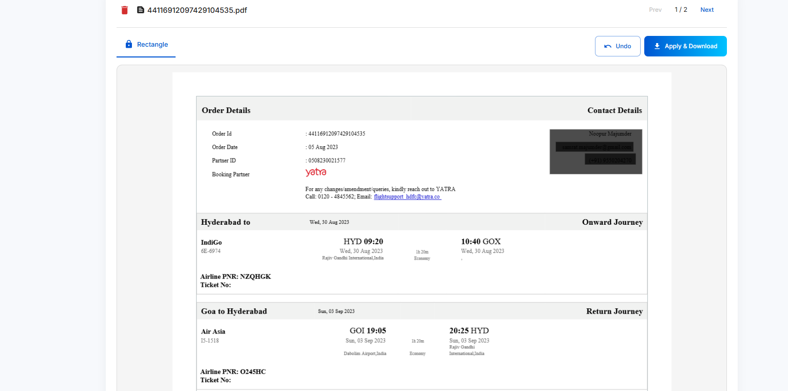

# Document Redaction Tool

A secure, client-side document redaction tool for permanently removing sensitive information from PDFs and images.



## 🔒 Features

- **Secure Client-Side Processing**: All document processing happens in your browser. Your documents never leave your device.
- **PDF & Image Support**: Supports PDF documents and common image formats (JPG, PNG, GIF)
- **Password-Protected PDFs**: Handles encrypted PDF files with password decryption option
- **Permanent Redaction**: Sensitive information is completely removed, not just visually covered
- **Multi-Page PDF Support**: Navigate and redact across multi-page documents
- **User-Friendly Interface**: Intuitive drag-and-drop interface with rectangle selection tool
- **Responsive Design**: Works on both desktop and mobile browsers
- **Free & Open Source**: Free to use, modify, and deploy

## 🛠️ Technologies Used

- **React**: UI framework
- **Material-UI**: Component library for modern UI design
- **PDF.js**: For PDF rendering and viewing
- **PDF-Lib**: For PDF manipulation and redaction
- **HTML Canvas API**: For image redaction and interaction
- **Vite**: For fast builds and development

## 🚀 Live Demo

Try it now at [redactor.deeparmada.com](https://redactor.deeparmada.com)

## 🧰 Installation & Development

### Prerequisites

- Node.js (v14 or later)
- npm or yarn

### Setup

1. Clone the repository:
```
git clone https://github.com/samratmajumder/document-redactor-online.git
cd document-redactor-online
```

2. Install dependencies:
```
npm install
```

3. Start the development server:
```
npm start
```

4. Visit `http://localhost:5173` in your browser

### Production Build

To create a production build:

```
./build.sh
```

This will generate optimized files in the `dist` directory ready for deployment.

## 🌐 Deployment

### Nginx Configuration

A sample nginx configuration is provided in `nginx.conf`. To use it:

1. Copy the built files to your web server:
```
cp -r dist/* /var/www/redactor.deeparmada.com/
```

2. Configure Nginx by placing the configuration in `/etc/nginx/sites-available/` and creating a symlink:
```
sudo cp nginx.conf /etc/nginx/sites-available/redactor.deeparmada.com
sudo ln -s /etc/nginx/sites-available/redactor.deeparmada.com /etc/nginx/sites-enabled/
sudo nginx -t
sudo systemctl reload nginx
```

3. Set up SSL certificate with Let's Encrypt:
```
sudo certbot --nginx -d redactor.deeparmada.com
```

## 🔧 Customization

### Branding

To customize the branding:

1. Replace the logo and branding in the `Header.jsx` component
2. Update the colors in the theme in `App.jsx`
3. Modify the footer in `Footer.jsx` to include your organization's details

### Features

To add new features:

- Add new redaction tool options in the `RedactionCanvas.jsx` component
- Support additional file formats by extending the handlers in `DocumentRedactor.jsx`
- Implement text detection or other advanced features by modifying the canvas interaction code

## 📝 How It Works

1. **Upload**: Users upload a PDF document or image (JPG, PNG). For password-protected PDFs, users will be prompted to enter the password.

2. **Redact**: Users draw rectangles over sensitive information they want to permanently remove using the intuitive canvas interface. The application handles coordinate mapping between display and actual document coordinates.

3. **Download**: When the user clicks "Apply & Download", the application:
   - Creates a copy of the original document
   - Applies permanent black rectangles over the selected areas
   - For PDFs, properly handles the coordinate system differences
   - Optionally removes password protection
   - Returns a securely redacted document that can be safely shared

## 🤝 Contributing

Contributions are welcome! Here's how you can contribute:

1. Fork the repository
2. Create a feature branch: `git checkout -b feature/amazing-feature`
3. Commit your changes: `git commit -m 'Add amazing feature'`
4. Push to the branch: `git push origin feature/amazing-feature`
5. Open a Pull Request

## 📜 License

Copyright © TeleNext Systems Pvt. Ltd.

---

**Note**: This tool is designed for privacy and security. All processing happens client-side in your browser, and your documents never leave your device.

Powered by TeleNext Systems - Using human-centric AI technologies to solve one problem at a time.